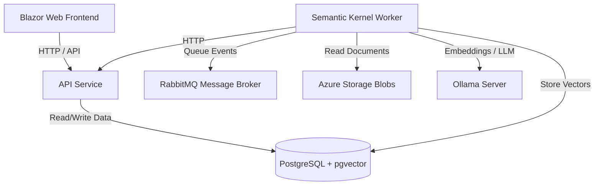

# System Architecture

The **DemoTfg** project is designed following a clean architecture pattern and orchestrated using **.NET Aspire**.

## Component Breakdown

### 1. Presentation & Execution Layers

- **`DemoTfg.AppHost`**: The central .NET Aspire orchestrator that spins up Docker containers for dependent services (Database, Queue, LLMs) and starts the C# services in the local environment with pre-configured environment variables and references.
- **`DemoTfg.Web`**: A Blazor Web application representing the frontend client. Users interact with this application to upload documents, manage subscriptions, and chat/query the assistant.
- **`DemoTfg.ApiService`**: The backend REST API. It serves the frontend, communicates with PostgreSQL, and manages metadata.

### 2. Core Business Logic & Infrastructure

- **`DemoTfg.Domain`**: Core domain logic, models, and entities.
- **`DemoTfg.Application`**: Use cases, command and query handlers, and interface definitions.
- **`DemoTfg.Infrastructure`**: Concrete implementation of interfaces such as databases, third-party clients, repository implementations, etc.
- **`DemoTfg.Worker`**: A background processor built on top of **Semantic Kernel**. It consumes messages from RabbitMQ, downloads documents from Azure Blob Storage, requests embeddings from Ollama, and inserts vectorized data into pgvector.

### 3. Cross-Cutting Concerns

- **`DemoTfg.ServiceDefaults`**: Implements OpenTelemetry setup, health checks, and service discovery configurations for all .NET microservices.
- **`DemoTfg.Tests`**: Unit and integration test suite.
