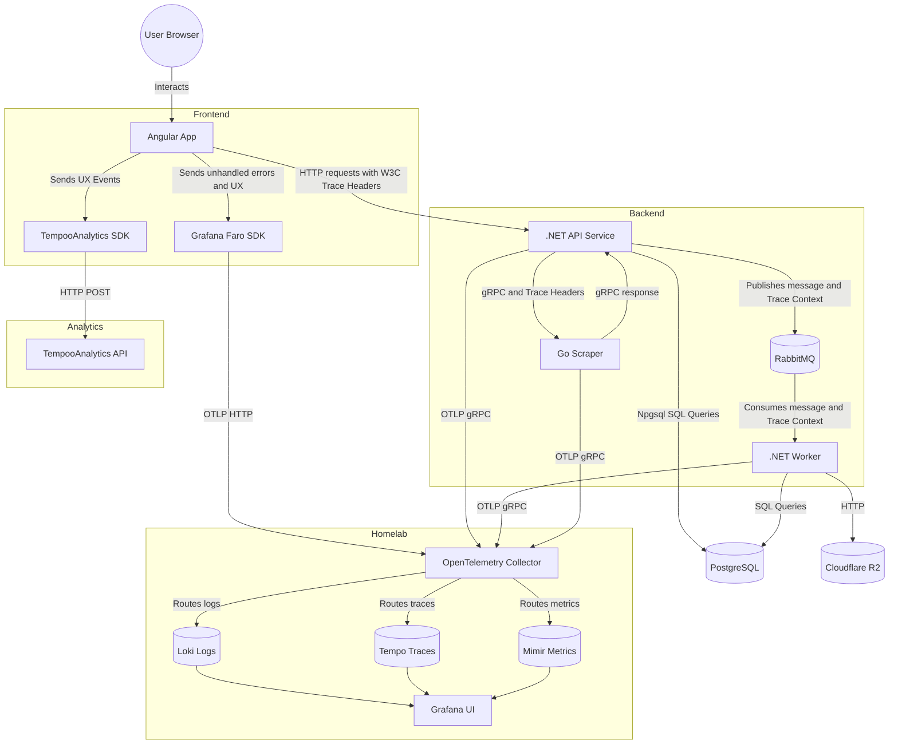

# Observability & Analytics Architecture

This document describes how the different components of the system connect to the self-hosted observability stack (Grafana) and the custom UX analytics service (TempooAnalytics).

## Architecture Diagram



## Homelab Setup Guide

To fully enable this architecture, your Homelab needs the following components exposed/accessible by the Dokploy server:

### 1. OpenTelemetry Collector (OTel Collector)
Instead of having `.NET`, `Go`, and `Angular` talk directly to Loki, Tempo, and Mimir, they all send data to the **OTel Collector**.
- **Role:** Receives OTLP data (logs, metrics, traces), batches them, and routes them to the correct database in Grafana.
- **Exposed Ports:** 
  - `4317` (OTLP/gRPC) for `.NET` and `Go` services.
  - `4318` (OTLP/HTTP) for the `Angular` frontend (Grafana Faro).

### 2. Grafana Stack
- **Loki:** Stores structured logs (exceptions, application logs).
- **Tempo:** Stores distributed traces (the timeline of a request across all services).
- **Mimir (or Prometheus):** Stores metrics (e.g., CPU, RAM, and custom LLM Token Consumption).
- **Grafana UI:** The dashboard where you connect Loki, Tempo, and Mimir as data sources.

## Environment Variables to Configure in Dokploy

Once your homelab is ready, you will need to add these environment variables to the `.NET` and `Go` containers in Dokploy:

```env
# URL of your Homelab's OTel Collector
OTEL_EXPORTER_OTLP_ENDPOINT=http://homelab-ip:4317

# Service Identification
OTEL_SERVICE_NAME=asistente-ayuntamiento-api # Varies per container
OTEL_ENVIRONMENT=production

# TempooAnalytics Config (for Frontend/Gateway)
TEMPOOANALYTICS_API_URL=https://analytics.tu-dominio.com/api
TEMPOOANALYTICS_API_KEY=tu-clave-secreta
```

## Trace Propagation (W3C)

The true power of this setup is the continuous trace context:
1. **Faro SDK** generates a Trace ID when the user clicks a button.
2. The browser sends the HTTP request to the `.NET API` with the header `traceparent: 00-traceid-spanid-01`.
3. The `.NET API` extracts it and continues the trace.
4. When the API queues a background job, it injects the `traceparent` into the **RabbitMQ message headers**.
5. The `.NET Worker` extracts it from RabbitMQ and continues the trace.
6. Any SQL queries to **PostgreSQL** are automatically grouped under this same Trace ID.
