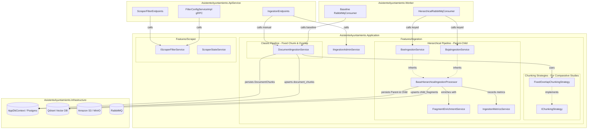

# Design: Reorganize .NET Application Services by Feature, Extensible Chunking Strategies for Benchmarking, and Discard BOPMA Data Ingestion

## Context

The current .NET solution structure deviates from Clean Architecture and Vertical Slice Architecture guidelines:
- Hierarchical ingestion services (`BoeIngestionService`, `BojaIngestionService`, `FragmentEnrichmentService`, `IngestionMetricsService`) reside in the host project `AsistenteAyuntamiento.Worker/Services`.
- Both gazette processors (`BoeIngestionService` and `BojaIngestionService`) duplicate over 80% of their logic: synthetic question generation with LLMs, token accounting, vector generation with `IEmbeddingGenerator`, entity creation and EF Core persistence for `ChildFragment`, gRPC payload creation for Qdrant, and metric telemetry reporting.
- **Scientific and Evaluation Motivation**: The project requires comparative testing and ablation studies to evaluate which chunking strategy maximizes legal RAG accuracy, lexical precision, and response quality. To support this research:
  1. The **Classic Baseline Pipeline** (fixed-size sliding window with configurable token overlap) must remain first-class and modular.
  2. The **Hierarchical Parent-Child Pipeline** must be consolidated and DRY.
  3. The architecture must introduce a clean, extensible **Chunking Strategy** design pattern in `Application/Features/Ingestion`, allowing new experimental chunking mechanisms (e.g., semantic boundary chunking, recursive markdown structure chunking, propositional chunking) to be introduced and benchmarked under identical conditions without rewriting persistence or vector stores.
- HTTP endpoints in `AsistenteAyuntamiento.ApiService` (`IngestionEndpoints.cs`, `ScraperFilterEndpoints.cs`) and the gRPC service (`FilterConfigServiceImpl.cs`) perform direct calls to `IAppDbContext`, Amazon S3, and RabbitMQ rather than invoking Application use-case services.
- Data ingestion for BOPMA (Boletín Oficial de la Provincia de Málaga) needs to be formally discarded to focus engineering resources strictly on national (BOE) and regional (BOJA) gazettes.

## Goals / Non-Goals

**Goals:**
- Move all ingestion and scraper business logic to `AsistenteAyuntamiento.Application` organized in feature folders (`Features/Ingestion` and `Features/Scraper`).
- Architect an extensible chunking model (`IChunkingStrategy` or modular chunking components) in `Application/Features/Ingestion` that allows:
  - Current fixed-size chunking with configurable overlap (`FixedOverlapChunkingStrategy`).
  - Hierarchical parent-child article/section extraction.
  - Future experimental chunking strategies for comparative testing and evaluation.
- Eliminate code duplication between hierarchical gazette processors via `BaseHierarchicalIngestionProcessor`.
- Extract ingestion administrative functions (S3 blob listing, caching, queue publishing for all pipeline modes, state resets) into `IIngestionAdminService`.
- Centralize scraper filter rule management and execution state in `IScraperFilterService` and `ScraperStateService`.
- Formally discard BOPMA data ingestion across all chunking and ingestion pipelines.
- Keep `AsistenteAyuntamiento.Worker` and endpoint classes thin and decoupled.

**Non-Goals:**
- Do not create a BOPMA ingestion processor for any pipeline.
- Do not modify database tables or execute new EF Core migrations.
- Do not change public API contracts, SignalR events, or gRPC interfaces.

## Decisions

### 1. Extensible Chunking Strategy Architecture (`Application/Features/Ingestion`)

To enable future benchmarking and comparative studies between different chunking algorithms:

#### A. Chunking Strategy Abstraction
```csharp
namespace AsistenteAyuntamiento.Application.Features.Ingestion.Chunking;

public record DocumentChunkResult(string Content, int ChunkIndex, Dictionary<string, string>? Metadata = null);

public interface IChunkingStrategy
{
    string StrategyName { get; }
    IReadOnlyList<DocumentChunkResult> Chunk(string content, DocumentMetadata? metadata = null);
}
```

- **`FixedOverlapChunkingStrategy`**:
  - Implements sliding-window chunking using `TextChunker.SplitPlainTextLines(content, maxLines)` (default 200) and `TextChunker.SplitPlainTextParagraphs(lines, maxTokens, overlapTokens)` (default 400 tokens / 50 overlap).
  - Used by `DocumentIngestionService` to produce baseline chunks.
- **Future Extensibility**:
  - Future experimental strategies (e.g., `SemanticBoundaryChunkingStrategy`, `MarkdownHeaderChunkingStrategy`, `AgenticChunkingStrategy`) can implement `IChunkingStrategy` and be selected via configuration or pipeline parameters for ablation tests.

#### B. Hierarchical Parent-Child Ingestion Pipeline
- **Base Class**: `BaseHierarchicalIngestionProcessor` (Template Method Pattern):
  ```csharp
  namespace AsistenteAyuntamiento.Application.Features.Ingestion;

  public abstract class BaseHierarchicalIngestionProcessor(
      IAmazonS3 s3Client,
      IAppDbContext dbContext,
      IFragmentEnrichmentService enrichmentService,
      IIngestionMetricsService metricsService,
      QdrantClient qdrantClient,
      Kernel kernel,
      ILogger logger) : IHierarchicalIngestionProcessor
  ```
- **Unified Flow**:
  1. Download raw file from S3/MinIO.
  2. Parse parent document via abstract `ExtractParentDocument(string rawContent, string documentId)`.
  3. Extract child sections via abstract `ExtractFragments(string rawContent, ParentDocument parent)`.
  4. Iterate through fragments: call `IFragmentEnrichmentService.EnrichFragmentAsync`, generate embeddings with `IEmbeddingGenerator`, persist `ChildFragment` to PostgreSQL, and build Qdrant points.
  5. Save to `ParentDocuments` / `ChildFragments` and upsert points to Qdrant collection `child_fragments`.
  6. Track telemetry via `IIngestionMetricsService.TrackIngestionAsync`.
- **Specialized Gazette Extractors**:
  - `BoeIngestionService`: Specialized in parsing XML documents (`XDocument`, `<articulo>`).
  - `BojaIngestionService`: Specialized in parsing JSON documents (`JsonDocument`).

### 2. Discarding BOPMA Data Ingestion Across All Pipelines

- **Decision**: Ingestion for BOPMA (Boletín Oficial de la Provincia de Málaga) will not be supported or implemented in either the baseline, hierarchical, or any future experimental chunking pipeline.
- **Rationale**: Current indexing targets national (BOE) and regional (BOJA) gazettes. Provincial gazettes have divergent, unstructured formats that do not justify LLM enrichment and ingestion costs at this stage.
- **Handling**: If a message or request arrives with `Source == "BOPMA"`, all ingestion processors will log an informative warning and skip processing without raising an unhandled failure or persisting bad data.

### 3. Extraction of `IIngestionAdminService`

To reduce `IngestionEndpoints.cs` to a clean routing layer:
- Define `IIngestionAdminService` in `Application/Features/Ingestion`:
  - `Task<BlobListResultDto> ListBlobsAsync(BlobListQueryParameters query, CancellationToken ct)` (with in-memory caching).
  - `Task<int> EnqueueBulkAsync(List<ProcessBlobRequest> requests, string pipelineMode, CancellationToken ct)`: Dispatches to `documents_to_process_baseline`, `documents_to_process_hierarchical`, or both, updating `DocumentJobStates`.
  - `Task<int> ReprocessAllAsync(string pipelineMode, CancellationToken ct)`: Iterates through S3 blobs, enqueuing for selected pipeline modes.
  - `Task ResetProcessingStatusAsync(string? documentId, CancellationToken ct)`.
  - `Task ResetStuckProcessingAsync(CancellationToken ct)`.
  - `Task ResetIngestionDatabaseAsync(CancellationToken ct)`.

### 4. Centralization of Scraper Filter Management in `IScraperFilterService`

In `Application/Features/Scraper`:
- Define `IScraperFilterService` with methods:
  - `Task<IReadOnlyList<ScraperFilterRule>> GetActiveRulesAsync(CancellationToken ct)`
  - `Task<IReadOnlyList<ScraperFilterRule>> GetAllRulesAsync(CancellationToken ct)`
  - `Task<ScraperFilterRule?> GetRuleByIdAsync(int id, CancellationToken ct)`
  - `Task<ScraperFilterRule> CreateRuleAsync(CreateFilterRuleDto dto, CancellationToken ct)`
  - `Task<bool> UpdateRuleAsync(int id, UpdateFilterRuleDto dto, CancellationToken ct)`
  - `Task<bool> DeleteRuleAsync(int id, CancellationToken ct)`
- Both `ScraperFilterEndpoints` and `FilterConfigServiceImpl` (gRPC) inject `IScraperFilterService`.
- Move `ScraperStateService` into `Application/Features/Scraper`.

### 5. Architectural Flow



## Risks / Trade-offs

- **Risk**: Namespace and DI registration breakages during refactoring.
  - *Mitigation*: Maintain identical method signatures and verify through the test suite (`dotnet test`).
- **Risk**: Extensibility overhead vs simplicity.
  - *Mitigation*: Keep `IChunkingStrategy` interface minimalistic and lightweight (`Chunk(string content, ...)` returning `IReadOnlyList<DocumentChunkResult>`), avoiding over-engineering while providing the necessary extension point for comparative tests.
